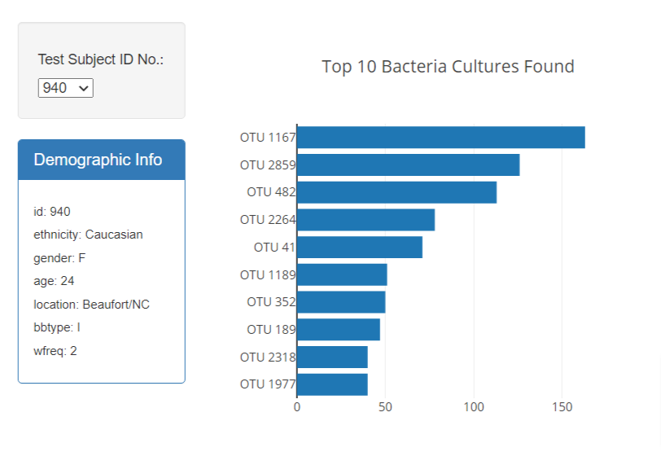
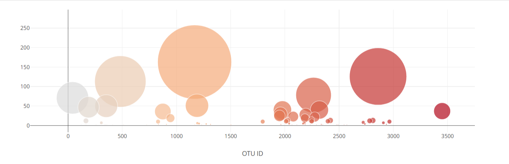

# Belly Button Biodiversity

At the top of the dashboard, users can select from the sample data in the dropdown and see the horizontal bar chart depict the top 10 microbial species present in the sample's belly button. Interestingly, the data shows that a small handful of these operational taxonomic units (OTUs) were present in roughly 70% of samples, while the rest were somewhat rare.

The dashboard also depicts a bubble chart of all OTUs present in the sample. This will also change upon user input to the dashboard.
